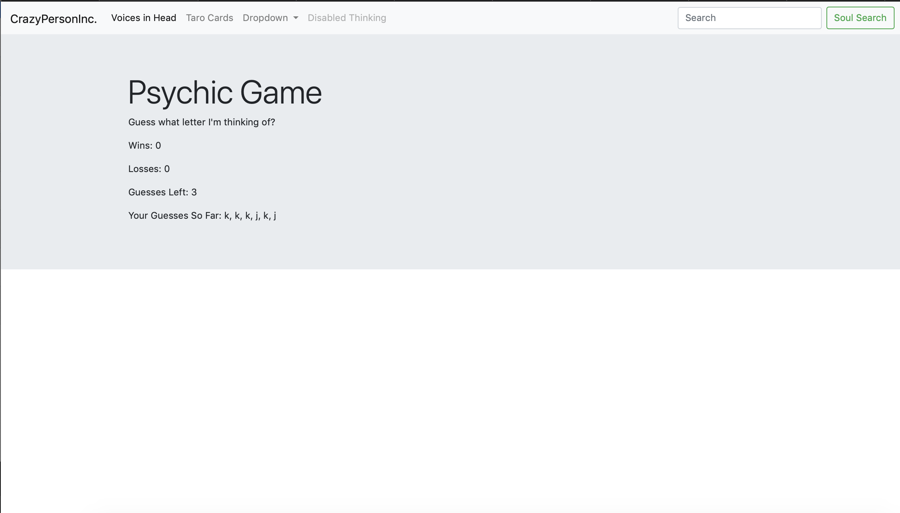
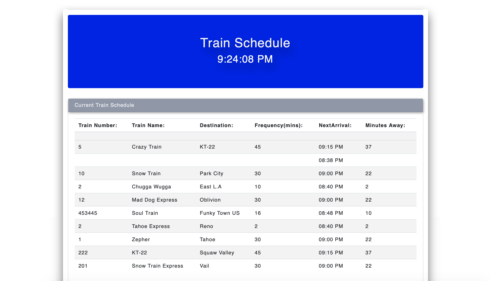

# newPortfolioPage

This is a readme for my updated portfolio page. This portfolio page is part of the a full stack web development course I'm taking at U.C. Berkeley. 

I have been learning and working with: HTML, CSS, JavaScritpt, jQuery, Firebase, Ajax, Bootstrap framworks, and other technology frameworks and libraries. 

Here are a few screenshots of my portfolio:

Here is a link to my new portfolio page:

https://dconlan1.github.io/newPortfolioPage/index.html

